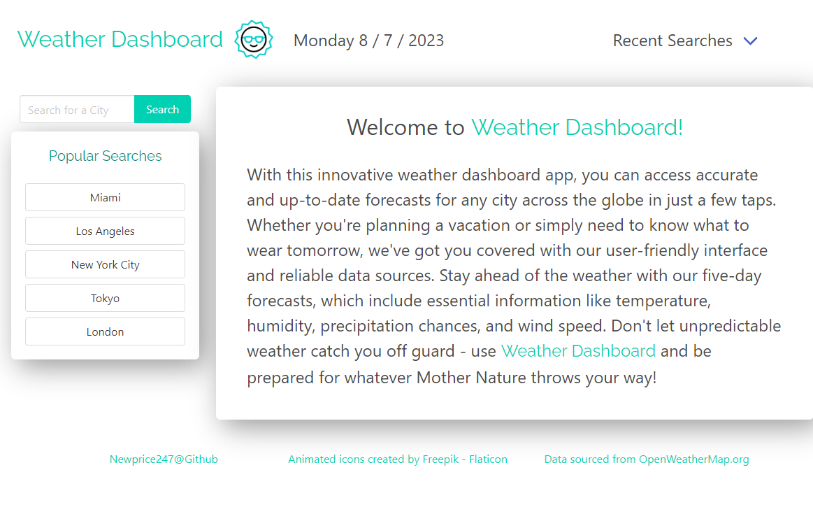

# Weather-Dashboard: Module 6 Challenge

## Description

The goal of this project was to build a web app that functions as a Weather Dashboard using the openweathermap API. The app would pull real-time data about the weather for any city around the world, and display the current weather as well as a five day forecast.

## Finished Project

### Comments

* The Weather Dashboard features a search bar the user can use to search for any city around the world (using the name of the city, zipcode, lat/lon)
* The app then loads the data and displays on screen the current day's weather, as well as the next five days' forecast.
* Once searched, the city is saved to local storage and displayed in the 'Recent Searches' dropdown menu at the top of the page.
* There is also a 'Popular Searches' section on the side of the page that contains various citys from across the world.
* The app features a clean aesthetic and includes various animated weather gifs that are displayed according to the type of weather on display.
### Deployed Website

[ Click Here to View Deployed Website](https://newprice247.github.io/Weather-Dashboard/)

## Credits

All of the animated icon gifs were sourced from [Flaticon.com](https://www.flaticon.com/free-animated-icons/weather), and the appropriate attribution to the author Freepik is included at the bottom of the Weather Dashboard page.

All weather data was retrieved via API from [Open Weather Map](https://openweathermap.org/forecast5).

## Contact Me

[Nathaniel Price](https://github.com/newprice247) @ Github
